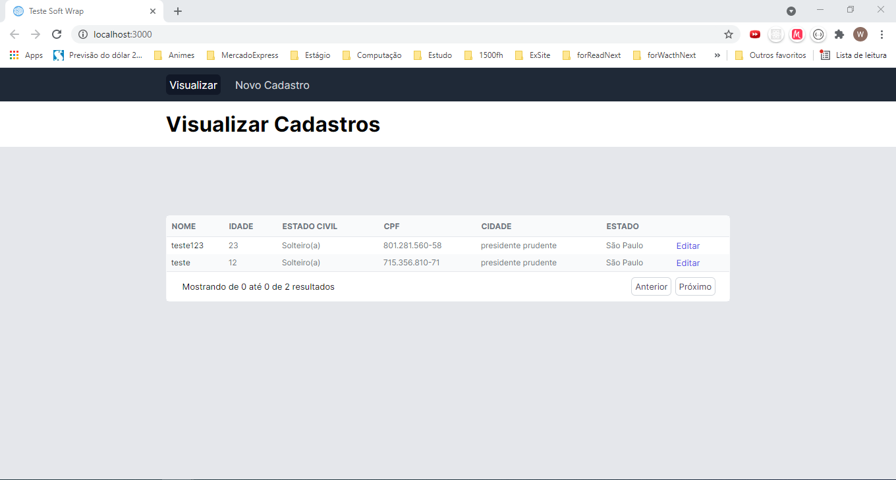
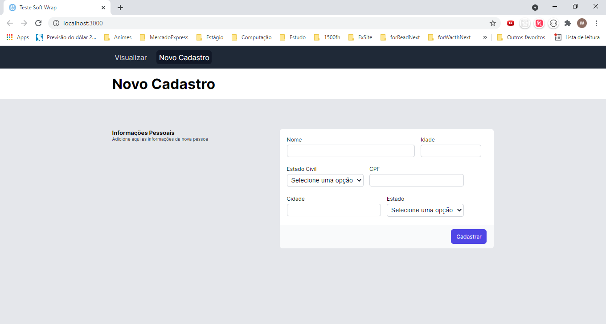
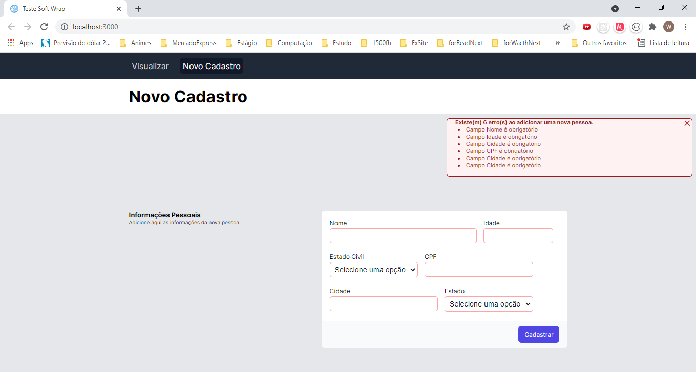
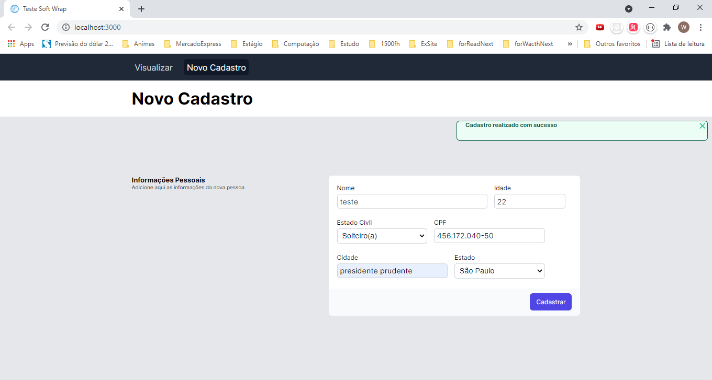

<h1 align="center">
    Teste para a vaga de desenvolvedor fullstack na SoftWrap
</h1>

<p align="center">
   <a href="https://www.linkedin.com/in/wellington-barros-593ba0137/">
      
   </a>
  <a aria-label="Completed" href="mailto:wf_tom@hotmail.com.br?subject=GitHub%20repo%20Teste%20Dev%20FullStack">
    </img>
  </a>
</p>

<p align="center">
  <a href="#bookmark-sobre">Sobre</a>&nbsp;&nbsp;&nbsp;|&nbsp;&nbsp;&nbsp;
  <a href="#eyes-demo-website">Demo Website</a>&nbsp;&nbsp;&nbsp;|&nbsp;&nbsp;&nbsp;
  <a href="#computer-tecnologias">Tecnologias</a>&nbsp;&nbsp;&nbsp;|&nbsp;&nbsp;&nbsp;
  <a href="#rocket-funcionalidades">Funcionalidades</a>&nbsp;&nbsp;&nbsp;|&nbsp;&nbsp;&nbsp;
  <a href="#construction_worker-como-rodar">Como rodar</a>&nbsp;&nbsp;&nbsp;|&nbsp;&nbsp;&nbsp;
  <a href="##bug-issues">Issue</a>&nbsp;&nbsp;&nbsp;|&nbsp;&nbsp;&nbsp;
  <a href="#memo-licença">Licença</a>
</p>

## :bookmark: Sobre

Esse teste consistia em fazer uma página para listagem dos usuários e outra para cadastro, edição e deleção. Para publicação do teste utilizei a [Vercel](https://vercel.com/), você pode acessá-lo aqui <a href="https://teste-front-end-wftom.vercel.app/"> TesteDevFullStack </a>, porém após publicá-lo ele está apresentando vários registros vazios em tela os quais não existem no banco, vou verificar e atualizo o repositório e utilizei como banco de dados o [Firebase](http://firebase.google.com/), não conheço bem sobre o firebase, porém quando publiquei a minha api na heroku, ela ficava offline, não retornava nenhum erro na publicação, mas não rodava então preferi perder um tempo com o firebase que fazia mais sentido para vaga, do que com o heroku, foi muito fácil lançar a api no firebase, porém nem tudo na aplicação funciona ainda "gostei do projeto, principalmente do layout o que ficou bem fiel ao protótipo e gastei bastante tempo, então vou estudar mais e melhorá-lo".
O projeto foi desenvolvido em [NextJs](https://nextjs.org) até mesmo por já hospedar na [Vercel](https://vercel.com/)com context, components e hooks, a api em [Firebase](http://firebase.google.com/), para a estilização usei o [styled components](https://styled-components.com/) pois ele deixa as coisas mais organizadas e um estilo não afeta os outros.

### Screenshots

<div>
   
   
</div>
<div>
   
   
</div>

Vou verificar se posso disponibilizar os protótipos.

# :eyes: Demo Website

Você pode acessar o site demo em: https://teste-front-end-wftom.vercel.app/

# :computer: Tecnologias

Esse projeto foi feito usando as seguintes tecnologias:

- [NextJS](https://nextjs.org)
- [ReactJS](https://reactjs.org/)
- [TypeScript](https://www.typescriptlang.org/)
- [styled components](https://styled-components.com/)

# :boom: Como rodar

- ### **Requisitos**

  - É **necessário** ter **[Node.js](https://nodejs.org/en/)** instalado
    no computador.
  - Além disso, é **necessário** ter um gerenciador de pacotes
    **[NPM](https://www.npmjs.com/)** ou **[Yarn](https://yarnpkg.com/)**.
  - É **opcional** ter **[Git](https://git-scm.com/)** instalado e
    configurado no computador, mas é melhor ter.

- ### **Observação**

  - Este projeto foi desenvolvido com node.js v14.17.0, você pode verificar sua versão usando node -v

```bash
# Clone o repositório
$ git clone https://github.com/wfTom/test-front-end.git
```

### 💻 Execute o Projeto

```bash
# Vá na pasta test-front-end
$ cd test-front-end

# Instale as dependências
$ yarn install ou npm install

#Crie o arquivo .env.local, existe o .env.example mostrando as variáveis de ambiente

# Rode a aplicação
$ yarn start ou npm run start
```

Acesse a aplicação em http://localhost:3000/

# :bug: Issues

Sinta-se à vontade para registrar uma issue com um título e descrição no repositório [TesteDevFullStack](https://github.com/wfTom/test-front-end/issues).
Se você já encontrou uma solução para o seu problema, adoraria revisar sua solicitação de pull!
É legal se puder deixar um feedback.

# :closed_book: Licença

Lançado em 2021

Feito com ❤︎ por [wfTom](https://github.com/wfTom) 🚀. Este projeto está sob a [MIT license](./LICENSE).

Dê uma ⭐️ se este projeto te ajudou!
